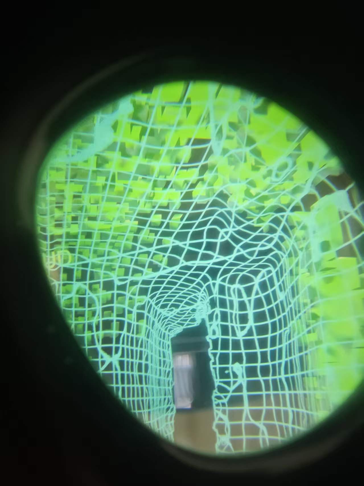
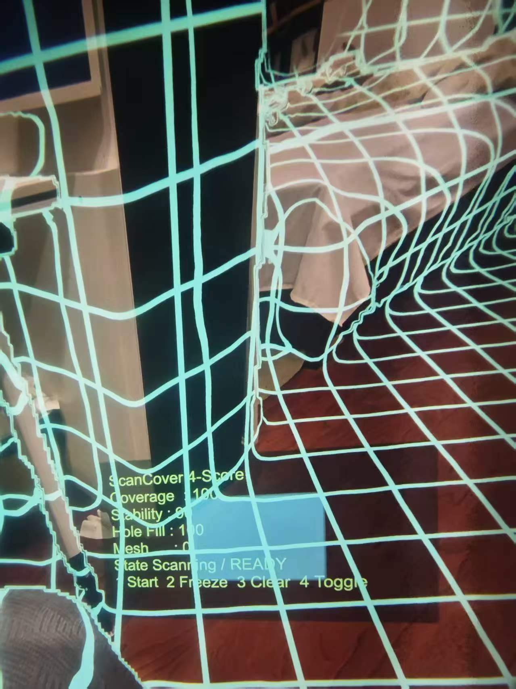
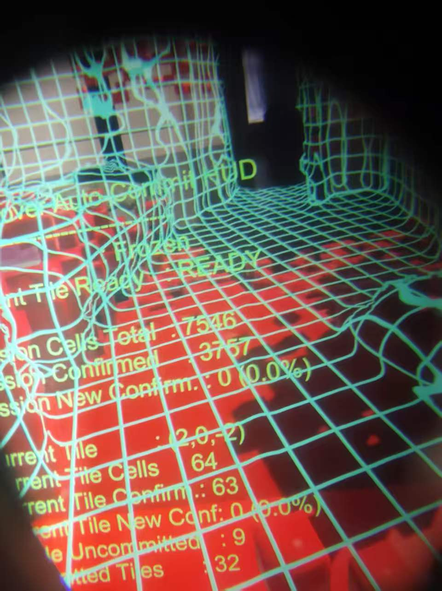
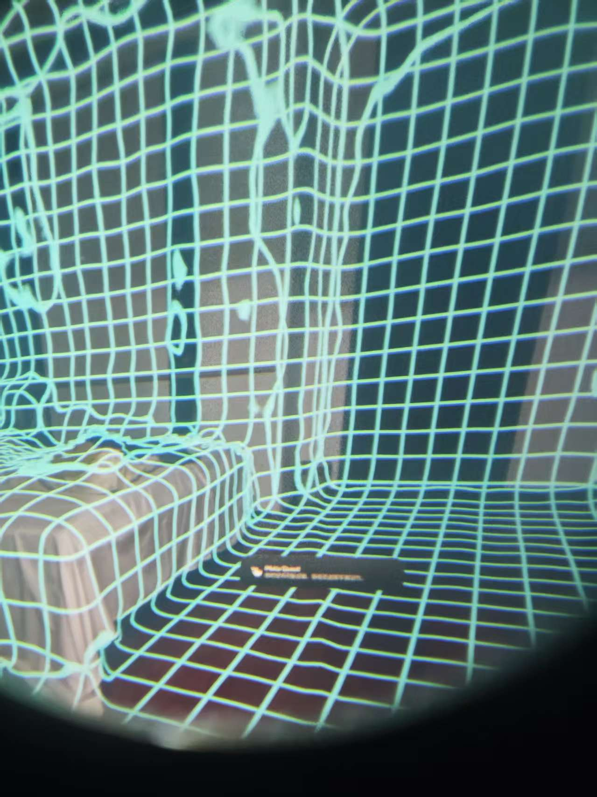

# Unity-MRMotifs-ScanCover

`Unity-MRMotifs-ScanCover` is a recovered Unity 6 / URP / OpenXR Quest 3 prototype based on Meta's MR Motifs sample project, focused on a `ScanCover` mixed reality scan-overlay effect.

The recovered effect combines:

- environment depth reprojection
- reveal-wave driven scan triggering
- world-space grid overlay rendering
- a ScanCover session / HUD pipeline for scanning, freezing, clearing, and inspection

The result is a room-conforming cyan scan grid that attaches to walls, floor, furniture, and openings instead of rendering as a flat screen-space pattern.

## Gallery

## Project Focus

The primary work in this repo lives under [Assets/MRMotifs/ScanCovet](./Assets/MRMotifs/ScanCovet), especially:

- `Scripts/MetaXR/02`
  Reveal wave shaders, materials, and scan trigger logic
- `Scripts/MetaXR/04`
  ScanCover skeleton builder, mesher, HUD, and display surface pipeline
- `Scripts/Archive/MetaXR/03_DepthRevealOverlay/03`
  URP renderer feature and depth overlay shader used to reconstruct the recovered effect
- `Scene/DepthEffects_ScanCover.unity`
  The main scene containing the restored wiring

## Key Recovery Notes

This recovered version depends on a few specific links being present at the same time:

- `DepthRevealOverlayRendererFeature` must be attached to the active URP Renderer Data
- `RevealManager` and `ShockwaveScanSpawnerMotif` must exist in the scene
- `ScanCoverSkeletonBuilder_A.gateByRevealWaves` must be enabled
- `EnvironmentDepthMatrixHelperMotif` must be enabled so `_EnvironmentDepthInverseReprojectionMatrices` is published

If any of those pieces are missing, the effect usually degrades into one of the broken intermediate states:

- no visible scan overlay
- a grid stuck in front of the viewer
- triangle topology wireframe instead of a continuous room-space grid

## Requirements

- Unity 6.3 LTS
- Universal Render Pipeline
- OpenXR Plugin
- Meta OpenXR / Meta XR Core SDK
- Quest 3 with environment depth support enabled

## Scene To Open

Open:

- [Assets/MRMotifs/ScanCovet/Scene/DepthEffects_ScanCover.unity](./Assets/MRMotifs/ScanCovet/Scene/DepthEffects_ScanCover.unity)

## Runtime Controls

The scene HUD reflects the active ScanCover session controls. In the restored setup the HUD shows the available scan / freeze / clear / toggle actions while the reveal-wave scan trigger drives the overlay expansion.

## Credits

- Original baseline: Meta `MR Motifs`
- Recovered / reassembled ScanCover branch: this repo
