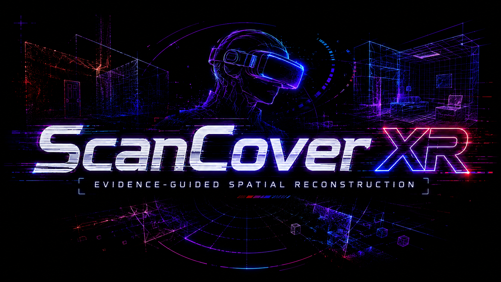

<p align="center">
  
</p>

# ScanCover：Quest 3 实时房间几何重建实验工程

ScanCover 是一个基于 Unity 6、Meta XR 与 Quest 3 环境深度的实时空间重建研究工程。

工程的最终目的不是单纯绘制一层“看起来像房间”的诊断网格，而是从持续变化、带噪声的头显深度观测中建立一层**稳定、可追责、可更新的空间几何支架**，为后续连续外皮和最终蒙皮提供可靠依据。

当前主线可以概括为：

```text
Quest 深度观测
  → 深度预处理与运动质量保护
  → 枪胶证据层（稳定候选、双证词、反对票）
  → 逐点／逐体素融合准入
  → TSDF 与支撑真值
  → 数据镜像／纸拓扑审计
  → 公共外皮合成
  → 最终蒙皮
```

本仓库仍是研究与实机验证工程，不是已经完成的通用房间扫描 SDK。

## 项目要解决的问题

Quest 3 的深度数据不是静态真值。视野位置、观测角度、头显角速度与线速度、遮挡边界、时序差异和传感器噪声都会让同一真实表面形成具有厚度的观测带。如果这些观测未经裁决便不断写入融合体，最终会出现：

- 平墙逐渐凹凸或鼓包；
- 转角、桌面侧面等复杂区域形成翘边、漂浮面或双层面；
- 旧错误几何无法及时退场；
- 网格出得慢、局部空洞长期不闭合；
- 管理块、页面提交和显示调度掩盖真实的数据层问题。

因此，本工程优先回答的不是“怎样把洞临时补上”，而是：

1. 哪一帧、哪一个点第一次偏离了稳定表面；
2. 它为什么被接受、待定或拒绝；
3. 错误从数据层、融合层、拓扑层还是显示消费层开始出现；
4. 在保留真实结构变化的前提下，如何让错误证据退出生产链。

## v2.4 的主要内容

### 枪胶证据裁决

“枪胶”是工程对局部深度证据模型的形象称呼：深度点像一颗颗弹丸打入带厚度的观测层，系统不直接把每一颗点当作真实表面，而是在局部维护少量候选，并记录其证据。

v2.4 已包含：

- 稳定候选与稳定 ID；
- 平台／生产双路证词及一致性检查；
- 可靠自由空间反对票；
- 候选淘汰与稳定候选换轨；
- 视野位置、角速度和线速度可靠度保护；
- 逐点／逐体素融合准入；
- 绿色“静海”与红色“浪头”裁决视图；
- 候选、退役、浪头及来源原因黑匣子。

这些机制工作在显示之前。诊断颜色只负责说明裁决结果，不反向修改几何事实。

### 支撑真值与纸拓扑

工程保留多种可切换的几何观察层：

- **BB 反投影点**：观察送入后续链路前的深度点；
- **枪胶裁决海**：观察稳定候选与被钉住的异常浪头；
- **支撑真值**：观察当前能够为外皮提供证据的稳定空间支撑；
- **纸拓扑／纸主网格**：审计覆盖范围、连续性、替换和退场是否忠实反映支撑数据；
- **三角粗皮与 HERA**：保留为几何精度、分页消费和历史路线的对照。

这里的“纸”不是最终视觉效果，而是公共外皮合成器之前的一道拓扑审计层。纸皮的好坏能够暴露外皮生产链的问题，但不能脱离支撑真值被单独美化。

### 可复现扫描会话

v2.4 能为一次实机扫描建立离线复现会话，记录：

- 生产融合输入与逐帧清单；
- 坐标、姿态、深度和生产配置契约；
- 枪胶候选及裁决黑匣子；
- 纸面与第一阶段几何快照；
- 完整性标记和 SHA-256 校验；
- 可选的 Quest 系统房间网格参考。

对应的离线工具位于 [`Tools`](./Tools)，用于确定性回放、系统参考对照和纸面闭合反事实分析。离线结果用于归因与验证，不取代 Quest 真机测试。

## 运行架构

生产链主要位于 [`Assets/QuestRoomScanStandalone`](./Assets/QuestRoomScanStandalone)：

```text
DepthCapture
  深度获取、双边／边缘／时序处理、头显运动状态

GunGelEvidenceShadow
  局部候选、双证词、反对票、稳定 ID、逐点生产权限

VolumeIntegrator + VolumeIntegration.compute
  受证据准入保护的投影式 TSDF 融合

MeshExtractor
  支撑真值、实时几何提取、冻结回放与诊断导出

StandaloneRoomScanner
  扫描状态、显示层切换、冻结、导出、HUD 与实验调度
```

HERA 的 32³／16³ 页面体系仍保留用于历史路线、冻结回放和局部精修对照，但管理块不应同时垄断数据稳定、出网范围、最终定稿和视觉连续性。

Meta Scene API／MRUK 系统房间网格位于独立参考链中，用于导出对照，不参与 ScanCover 的生产融合裁决。

## 环境要求

- Unity `6000.3.9f1`
- Universal Render Pipeline `17.3.0`
- Meta XR SDK `205.0.0`
- Unity OpenXR `1.16.1`
- Meta OpenXR `2.5.0`
- 支持 Environment Depth 的 Quest 3
- Android 构建环境

主实验场景：

[`Assets/QuestRoomScanStandalone/Scenes/QuestRoomScanStandalone.unity`](./Assets/QuestRoomScanStandalone/Scenes/QuestRoomScanStandalone.unity)

系统房间网格参考导出场景：

[`Assets/MRMotifs/ScanCover/Scene/Meta Scene Mesh.unity`](./Assets/MRMotifs/ScanCover/Scene/Meta%20Scene%20Mesh.unity)

## Quest 手柄操作

以下为当前独立扫描场景的主要操作：

| 操作 | 功能 |
| --- | --- |
| 右扳机 | 开始或继续采集 |
| A | 冻结共享 TSDF；非切块实验时暂停采集 |
| B | 导出当前结果；具体清理行为由当前实验模式决定 |
| 普通 X | 关闭 → 枪胶裁决海 → BB 反投影 → 关闭 |
| 左握把 + X | 开关平台／QRS 双路逐帧采集 |
| 右摇杆按下 | 扫描期间切换纸网、支撑真值、三角粗皮和 HERA 等视图 |
| 右摇杆上 + 按下 | 开关实时几何轨 |
| 右摇杆左 + 按下 | 空卷时切换胶冻／原冻实验 |
| 右摇杆下 + 按下 | 切换融合频率 20／10 Hz |
| 右摇杆右 + 按下 | 切换双边与边缘深度预处理 |
| 左摇杆按下 | 切换线框／实体或当前视图的审计子模式 |
| 左摇杆上 + 按下 | 开关源头时序滤波 |
| 左摇杆右 + 按下 | 开关 32³ 管理块线框 |
| Y | 冻结后切换 64³／32³／16³ 回放档 |

HUD 会随实验模式变化；判断操作是否到达时，以 HUD 的“最近按键”和当前模式回显为准。

## 诊断数据

Quest 真机上的默认诊断目录为：

```text
Android/data/com.pcaii.scancover.quest3/files/ScanCoverDiagnostics
```

其中可能包含深度双采、枪胶候选审计、裁决浪头、纸面发布账、几何分类账、回放会话包和系统参考模型。不同实验只会生成与其相关的子目录。

诊断数据的原则是“够用以说明问题”，不是无限堆积统计。任何修复都应优先落在数据事实或生产契约上，而不是继续给显示层叠加掩盖问题的补丁。

## 当前状态与验证边界

v2.4 已把调查重点从 HERA 页面显示和整块冻结，前移到深度证据、候选身份及融合准入；它提供了定位浪头来源和离线复现所需的主要记录链。

仍需持续通过 Quest 真机验证的内容包括：

- 复杂结构中的候选换轨是否能及时清退旧深度；
- 支撑真值到纸拓扑、公共外皮之间是否保持一一对应；
- 公共外皮的连续性与局部几何精度如何兼得；
- 最终蒙皮在长时间扫描和户外环境中的稳定性。

仓库中的线框、点云、纸皮和颜色均为诊断手段，不代表最终产品视觉方案。

## 来源

工程最初基于 Meta 的 [`Unity-MRMotifs`](https://github.com/oculus-samples/Unity-MRMotifs) 样例恢复并扩展，目前生产主线已转为独立的 QuestRoomScanStandalone 实验链。

本项目还参考了公开的 Quest 深度采集与 RGB-D 对齐实践，但所有参考数据和系统房间网格都只作为验证证据，不直接替代本工程的数据裁决。
